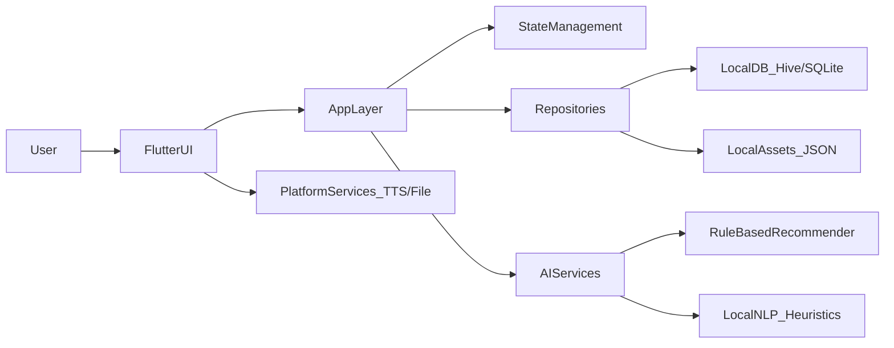

## InkMind（墨智）总体规划

### 一、对标「七猫免费小说」的产品构成

- **核心模块**
  - **内容发现**：书城首页、分类、排行榜（热度榜、新书榜、完结榜）、专题/活动页。
  - **搜索与筛选**：搜索框、搜索历史、猜你想搜，按分类、标签、字数、完结状态等筛选。
  - **书籍详情**：封面、简介、标签、字数、状态、评分/热度、目录入口、加入书架、开始阅读。
  - **书架**：已收藏/在读/已读书籍，分组、排序（最近阅读、上架时间等），多选管理。
  - **阅读器**：仿实体书/长屏滚动、白天/夜间模式、字体字号/行距/页边距、亮度、章节跳转、进度条、章节内搜索、阅读时长/字数统计。
  - **听书（TTS）**：文字转语音播放、倍速调节、耳机控制、后台播放。
  - **账号与同步**：登录、云书架和阅读进度云同步（本项目由于无后端先做本地）。
- **运营与商业化（本项目先不做，但作为对标参考）**
  - 广告插入、金币任务、签到、师徒拉新、会员去广告等。
- **AI 相关能力（七猫自研方向，对 InkMind 的启发）**
  - 用户行为画像 + 推荐模型（书籍排序、猜你喜欢）。
  - 阅读行为分析（偏好题材、时段、时长）。

### 二、InkMind 产品范围（本次大赛 Demo）

在「对标七猫」基础上，结合你选项“全平台 + 多种内容来源”，规划为：

- **MVP 必做功能**（全部多端统一实现）
  - **本地书城 & 搜索**：基于本地 JSON 素材的“书库”，支持搜索书名、作者、标签。
  - **书架**：加入/移除书架，最近阅读排序，本地持久化保存。
  - **阅读器**：支持横向分页/纵向滚动二选一（优先纵向滚动，兼容多端）、夜间模式、字体大小调节、阅读进度自动记录。
  - **阅读进度本地记录**：按「设备本地」保存每本书的章节 & 段落偏移，重进自动从上次位置开始。
- **AI 相关亮点（面向大赛评委）**
  - **智荐（AI 推荐）**：
    - 第一阶段：基于规则的“轻量推荐”（按用户阅读历史+标签匹配+阅读时长排序），离线可跑。
    - 为 PPT 预留第二阶段：可以接入云端 LLM/推荐 API 的扩展设计。
  - **智声（AI 朗读）**：基于 `flutter_tts` 或平台 TTS，实现文本朗读、倍速、暂停/继续。
  - **智记（AI 书摘）**：
    - 第一阶段：本地简单 NLP 规则选择“长句+关键字”作为高亮句。
    - Demo 中预置若干章节的“AI 摘要/金句”数据，展示交互与效果。
  - **阅读行为分析**：本地统计每日阅读时长、连续天数、偏好类别等，生成简单“阅读画像”视图。
- **内容来源规划**
  - **公版/自创示例书库**：内置 5–10 本示例书（四大名著选段、自创示例、科幻/都市等），完整章节结构但篇幅可适当压缩以减小 APK 体积。
  - **本地导入**：支持导入 TXT（后续扩展 EPUB），主要用于展示“用户自己的书也能读”。
  - **未来扩展占位**：在数据层预留“远程来源”字段，方便后续接入真后端或第三方内容源。

### 三、技术架构设计（Flutter + FVM + 多端）

- **技术栈约束与 FVM 方案**
  - 使用 **FVM 管理两套版本**：
    - `custom_3.22.1`：用于编译鸿蒙（3.22.1-ohos-1.0.7）。
    - `3.35.3`：用于其他端（Android/iOS/Web/Windows/macOS），便于使用较新特性。
  - 项目层面使用 `.fvm/fvm_config.json` 锁定默认版本为 `custom_3.22.1`，构建其它端时可临时切换。
- **分层架构**

- **模块划分（建议目录）**
  - `[lib/main.dart](lib/main.dart)`：入口、路由初始化、全局主题。
  - `[lib/core/](lib/core/)`：常量、主题、路由、基础工具方法、异常处理。
  - `[lib/data/models/](lib/data/models/)`：`Book`、`Chapter`、`ReadingProgress`、`BookshelfItem`、`UserPreference`、`Highlight` 等数据模型。
  - `[lib/data/datasources/](lib/data/datasources/)`：
    - `local_assets/`：从 `assets/books/*.json` 读取内置书库。
    - `local_storage/`：Hive/SQLite 存储书架、进度、用户设置、统计。
  - `[lib/data/repositories/](lib/data/repositories/)`：对外提供 `BookRepository`、`BookshelfRepository`、`ReadingRepository`、`StatsRepository`。
  - `[lib/features/home/](lib/features/home/)`：首页、推荐、统计卡片。
  - `[lib/features/search/](lib/features/search/)`：搜索页、筛选器。
  - `[lib/features/bookshelf/](lib/features/bookshelf/)`：书架页面及增删改排序逻辑。
  - `[lib/features/reader/](lib/features/reader/)`：阅读器 UI、阅读设置、进度同步逻辑。
  - `[lib/features/ai/](lib/features/ai/)`：
    - `recommendation/`：规则推荐实现。
    - `highlights/`：本地“关键句”抽取、预置书摘展示。
    - `tts/`：朗读服务封装（`TtsService`）。
  - `[lib/features/import/](lib/features/import/)`：本地文件导入、编码检测、分章节解析。
- **状态管理建议**
  - 使用 **Riverpod/Flutter_riverpod** 或 **Bloc/Cubit**，实现：
    - `HomeViewModel` / `HomeCubit`：负责推荐/统计数据获取。
    - `SearchViewModel`：搜索关键字、结果列表。
    - `BookshelfViewModel`：书架列表、排序方式、批量操作。
    - `ReaderViewModel`：当前章节、滚动位置/页码、阅读设置。
    - `AiHighlightViewModel`：当前章节书摘、文案展示。

### 四、数据模型与本地存储设计

- **核心数据结构（简要）**
  - `Book`：id、title、author、coverUrl、本地图标、tags、category、wordCount、status、intro、sourceType（asset/localFile/futureRemote）。
  - `Chapter`：id、bookId、index、title、contentPath/offset（可将正文拆为独立文件）。
  - `ReadingProgress`：bookId、chapterIndex、scrollOffset/pageIndex、updatedAt。
  - `BookshelfItem`：bookId、addedAt、lastReadAt、pinTop、groupName。
  - `ReadingStats`：date、minutes、words、booksRead。
  - `AiHighlight`：bookId、chapterIndex、sentences[List]、summary。
- **本地存储技术选型**
  - **轻量优先**：推荐使用 **Hive** 或 **Drift(SQLite)**。
    - 书架、阅读进度、阅读统计、用户设置、AI 摘要缓存 → 表/Box 存储。
  - 书籍正文：出于体积与加载效率考虑：
    - 示例书使用 `assets/books/{bookId}/{chapterIndex}.txt`。
    - 本地导入书籍则以解析后的结构写入 `ApplicationDocumentsDirectory` 中，每章一个文件 + 一个索引 JSON。

### 五、关键功能实现规划

#### 1. 书城 & 搜索

- **目标**：实现本地书库浏览、分类筛选、关键字搜索。
- **实现要点**：
  - 在 `assets/books/catalog.json` 维护书籍元数据列表。
  - `BookRepository` 提供：`getAllBooks() / searchBooks(keyword, filters)`。
  - 搜索使用简单的本地索引（标题/作者/标签 contains），为未来接云端搜索预留接口。

#### 2. 书架

- **目标**：
  - 加入/移除书架、最近阅读排序、只在本地保存。
- **实现要点**：
  - `BookshelfRepository` 管理 `BookshelfItem` 的 CRUD。
  - 进入阅读器或返回时自动更新 `lastReadAt`，首页/书架按 `lastReadAt` 排序展示“继续阅读”。

#### 3. 阅读器 + 进度

- **目标**：
  - 实现舒适的阅读体验 + 跨章节/重启后自动回到上次位置。
- **实现要点**：
  - 采用 `CustomScrollView` + `SelectableText` 或 `ListView` 形式的长文阅读，减少跨端分页差异。
  - `ReaderViewModel` 负责：
    - 初始化时加载对应书籍/章节内容。
    - 监听滚动位置，在 `onScrollEnd` 或节流回写 `ReadingProgress` 到本地。
  - 夜间模式、字体等设置存至 `UserPreference`，与 `ThemeData` 绑定。

#### 4. AI 智荐（规则推荐）

- **目标**：在无后端、无大模型本地推理的前提下，提供“看起来智能”的推荐模块，重点用于 PPT 与 Demo 展示。
- **实现要点**：
  - 设计一个 `RecommendationEngine`：
    - 输入：用户阅读历史（阅读时长、完成度）、书籍标签、最近活跃时间段。
    - 输出：一组排序后的书籍 ID 列表（“为你推荐”、“同类推荐”）。
  - 使用加权规则（例：最近阅读类别 +3 分、用户喜欢的标签 +2 分、整体热度 +1 分）。
  - 在首页展示“智荐”区块，给予解释性文案（如“根据你最近常看的武侠题材，为你推荐……”）。

#### 5. AI 书摘（智记）

- **目标**：自动或半自动给出每章的“重点句/摘要”。
- **实现要点**：
  - 第一阶段（离线规则）：
    - 文本分句后，基于长度、包含关键词（“重要”、“然而”、“因此”等）和标点结构，挑出若干句作为候选高亮。
  - Demo 优化：
    - 对于内置示例书，在 `assets/books/{bookId}/highlights.json` 预置若干高质量“AI 书摘”，前端同样以 AI 角度展示。
  - 在阅读器中加入“本章书摘”侧边栏或底部弹窗。

#### 6. AI 朗读（智声）

- **目标**：为章节内容提供一键朗读、暂停、倍速功能。
- **实现要点**：
  - 引入 `flutter_tts`，封装为 `TtsService`，提供：`speak(text) / pause() / stop() / setRate()`。
  - 阅读器中提供“朗读”按钮，默认从当前可见位置开始朗读。
  - 不做云端 TTS，自然依赖系统 TTS 引擎，保障纯前端架构。

#### 7. 阅读行为分析与可视化

- **目标**：为 AI 主题加分，展示“阅读画像”。
- **实现要点**：
  - 在阅读时长统计中记录每日阅读分钟数、阅读书本数量、主要类别。
  - 在首页或“我的”页面展示简单图表（折线/柱形，Flutter chart 库或自绘）。
  - 生成简单文案：“你更爱在晚上 9 点后阅读武侠和科幻”。

#### 8. 本地导入 TXT

- **目标**：支持用户导入本地文本，展示“个人书库能力”。
- **实现要点**：
  - 使用 `file_picker` 选择文件。
  - 编码检测（utf-8/gbk 基本处理），简单按“空行 + 标题规则”切章节。
  - 将解析结果写入本地目录，并在 `BookRepository` 中新增对应 Book/Chapters 记录。

### 六、多端适配策略

- **Android/iOS/鸿蒙**
  - 统一使用 Material 风格 + 适度定制，保证布局自适应不同尺寸与刘海屏。
  - 鸿蒙专用构建链使用 `custom_3.22.1`，并确保第三方插件（file_picker、flutter_tts 等）在鸿蒙可用，如不支持则在鸿蒙端降级隐藏相关功能。
- **Web**
  - 重点适配：阅读器、书城列表、书架。
  - 注意：Web 端本地文件权限与字体渲染差异，导入 TXT 功能只在桌面浏览器支持。
- **Windows/macOS**
  - 使用自适应布局（如 `LayoutBuilder` + `AdaptiveScaffold`），在大屏上采用左右分栏（左书架/目录，右阅读）。

### 七、项目结构与开发步骤

- **阶段 1：项目初始化与基础框架**
  - 使用 FVM 初始化 Flutter 工程，配置多端目标和基础依赖（Riverpod、Hive/Drift、flutter_tts、file_picker 等）。
  - 搭建基础路由结构：首页/书架/阅读器/设置。
- **阶段 2：数据层与本地书库**
  - 设计并实现数据模型与仓库接口。
  - 准备示例书籍 JSON 与章节文件；实现从 assets 加载书库。
- **阶段 3：书城、搜索与书架**
  - 实现首页书城列表、搜索功能、书籍详情页。
  - 实现书架列表及本地持久化。
- **阶段 4：阅读器与进度**
  - 实现阅读界面、夜间模式、字体调整。
  - 实现阅读进度记录与恢复。
- **阶段 5：AI 功能（智荐/智记/智声）**
  - 接入 TTS，实现朗读控制 UI。
  - 实现规则推荐引擎与首页推荐位。
  - 实现书摘侧栏（结合规则抽取 + 预置高质量文案）。
- **阶段 6：阅读统计与画像**
  - 接入阅读时长统计，绘制简单图表和个性化文案。
- **阶段 7：多端构建与优化 + 大赛材料**
  - 完成 Android/iOS/鸿蒙/Web/PC 的基础打包验证。
  - 为大赛准备：
    - 演示 PPT：产品愿景、架构图（含 FVM、多端、AI 模块）、核心功能截图、AI 场景说明。
    - Demo 视频：包含书城搜索、加入书架、阅读、朗读、AI 书摘与推荐、阅读画像浏览等完整流程。

### 八、Todo 列表

- **setup-fvm-flutter**：使用 FVM 初始化 InkMind 工程，配置 `custom_3.22.1` 适配鸿蒙，并验证 Android/Web 构建链。
- **design-data-models**：完成 Book/Chapter/ReadingProgress/Bookshelf 等数据模型与存储方案设计。
- **implement-local-library**：实现从 assets 读取本地书库与搜索功能。
- **implement-bookshelf-module**：实现书架页面与本地持久化逻辑。
- **implement-reader-module**：实现阅读器 UI、阅读设置、进度记录与恢复。
- **implement-ai-features**：实现规则推荐、AI 书摘展示和 TTS 朗读能力。
- **implement-reading-stats**：实现阅读行为统计与画像页面。
- **multi-platform-builds**：完成 Android/iOS/鸿蒙/Web/Windows/macOS 的基础打包与关键页面适配。
- **prepare-contest-assets**：制作比赛所需 PPT 和 Demo 视频，突出“AI+阅读+多端 Flutter”的亮点。

