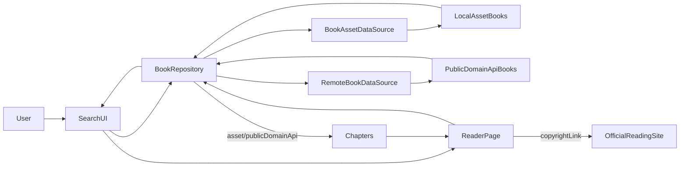

## 目标

- **解释当前为何都是“选读”且看不到整本书**，以及与版权的关系。
- **设计一套方案**：在保证版权合规的前提下，通过网络搜索和在线阅读方式获取完整书籍内容，并接入到现有 Flutter 阅读器架构中。

## 现状分析

- **本地书库形式**：
  - `assets/books/catalog.json` 中的书（如《西游记（选读）》）只是放在应用 `assets` 里的**节选版本**，字段中写的是 `"detailAsset": "assets/books/xiyouji.json"`。
  - 对应的 `xiyouji.json` 里只有几章经典章节，用来做示例和体验，所以 UI 上标明是“选读”。
- **章节加载逻辑**：
  - `ReaderPage` 通过 `BookRepository.getChaptersForBook(book)` 加载章节：

```23:40:lib/data/repositories/book_repository.dart
Future<List<Chapter>> getChaptersForBook(Book book) async {
  final existing = _cachedChapters[book.id];
  if (existing != null) {
    return existing;
  }

  final detailAssetPath = book.toJson()['detailAsset'] as String?;
  if (detailAssetPath == null) {
    return const [];
  }

  final result = await _assetDataSource.loadBookDetail(detailAssetPath);
  _cachedChapters[book.id] = result.$2;
  _mergeBook(result.$1);
  return result.$2;
}
```

- 当前所有可实际阅读的内容都来自 `assets`，即**应用包内自带文本**，而不是在线抓取。
- **版权含义**：
  - 对于仍在版权期内的作品，不能把完整正文直接打包进 `assets` 里，否则分发应用本身就涉嫌侵权。
  - 现在的做法是：
    - 对公版/古籍，打包少量节选示例（“选读”）；
    - 对现代正版作品，用 `sourceType: copyrightLink` + `externalUrl` 的方式，只提供**跳转到官方平台阅读**。

## 目标状态：在线公版书全文阅读

- **你想要的体验**：
  - 在应用里输入关键字搜索（书名/作者等）。
  - 搜索结果既可以来自本地示例书，也可以来自**在线公版书源 API**。
  - 点进一本在线公版书后，可以在当前 `ReaderPage` 里**完整章节阅读**，内容来自网络，而不是打包在 APK/IPA 内。
- **合规思路**：
  - 只对**明确是公版/开放许可**的数据源做“在线全文阅读”（例如古籍、公版小说、开放版权库）。
  - 对仍在版权期、但提供开放阅读页面的书，沿用当前 `copyrightLink` 模式：
    - 搜索时显示在结果里；
    - 详情/阅读页里给出“前往官方阅读”的按钮，通过浏览器或 WebView 打开官方链接，而不是抓正文。

## 技术方案概览

- **数据层扩展**：
  - 已有的抽象接口：

```1:31:lib/data/datasources/remote/remote_book_data_source.dart
abstract class RemoteBookDataSource {
  Future<List<Book>> searchRemote(String keyword);

  Future<(Book, List<Chapter>)> fetchPublicDomainBook(String apiBookId);
}
```

- 计划：
  - 实现一个或多个 `RemoteBookDataSource` 具体类，对接公版书 API（例如某开放古籍/公版小说接口，计划中用占位 URL 和字段，方便后续替换成你选定的真实服务）。
  - 将这些远程书按 `BookSourceType.publicDomainApi` 标记；书的元数据由 API 返回，章节内容按需分页获取。
- **仓库层整合**：
  - 在 `BookRepository` 中：
    - `getAllBooks()` 继续返回本地资产书 + 远程元数据缓存（如有需要）。
    - `searchBooks(keyword)` 已经支持本地 + 远程合并，只需要真正实现 `RemoteBookDataSource.searchRemote` 即可：

```42:66:lib/data/repositories/book_repository.dart
final remoteSource = _remoteDataSource;
if (remoteSource == null) {
  return localMatches;
}

final remote = await remoteSource.searchRemote(keyword);
final existingIds = localMatches.map((b) => b.id).toSet();
final merged = [
  ...localMatches,
  ...remote.where((b) => !existingIds.contains(b.id)),
];
return merged;
```

- 为 `getChaptersForBook(book)` 增加分支：
  - 如果 `book.sourceType == BookSourceType.asset`：走现在的 `detailAsset` 本地 JSON。
  - 如果 `book.sourceType == BookSourceType.publicDomainApi`：调用 `remoteDataSource.fetchPublicDomainBook(book.remoteApiId!)`，再缓存章节。
  - 如果是 `copyrightLink`：继续返回空章节，在 `ReaderPage` 使用现有 `_buildEmptyBody()` 的“跳转官方阅读” UI。
- **模型扩展**：
  - 已有 `Book` 模型新增了 `detailAsset` 字段；接下来只需确保：
    - 从远程 API 来的 `Book` 使用 `remoteApiId` 标记远程 ID；
    - `sourceType` 合理区分 `asset/publicDomainApi/copyrightLink`。

## UI & 交互设计

- **首页/搜索页**（`home_page.dart`）：
  - 维持现有搜索框交互，只需要：
    - 在展示结果时，根据 `sourceType` 打上轻量标签，如“本地示例”“公版在线”“正版跳转”。
  - 考虑在搜索时增加一个**来源过滤器**（全部/仅本地/仅公版在线）。
- **书籍详情/阅读入口**：
  - 用户点击任意一个搜索结果：
    - 若 `sourceType == asset` 或 `publicDomainApi`：直接进 `ReaderPage(book: book)`，内部由仓库决定从本地还是网络加载章节。
    - 若 `sourceType == copyrightLink`：
      - 可以直接使用现有逻辑，在 `ReaderPage` 里提示“本书为官方正版链接资源”，并提供“前往官方阅读”按钮。
- **阅读页体验**（`reader_page.dart`）：
  - 对于在线公版书，`ReaderController.init()` 在调用 `_bookRepository.getChaptersForBook` 时可能会触发网络请求：
    - 初次加载展示 `CircularProgressIndicator`；
    - 支持失败提示（如网络错误、API 限流）。
  - 保持 AI 书摘、TTS 阅读等能力正常工作（基于 `Chapter.content` 文本，不区分来源）。

## 数据流示意




## 关键实现步骤

- **步骤 1：定义远程 API 协议**
  - 选定一个或多个公版书源 API（可先用假数据/Mock 适配器代替真实接口）。
  - 明确其搜索接口参数（关键字、分页）、返回字段（书名、作者、简介、封面 URL、远程 ID）以及章节获取接口（章节列表、章节正文）。
- **步骤 2：实现 `RemoteBookDataSource`**
  - 新建如 `OpenPublicDomainApiDataSource` 实现，使用 `http` 包发起请求。
  - 把远程结果映射成 `Book` / `Chapter` 模型，设置：
    - `sourceType: BookSourceType.publicDomainApi`；
    - `remoteApiId` 填远程书 ID；
    - `wordCount/heatScore/tags` 由远程或适当估算。
- **步骤 3：在 `BookRepository` 中接线**
  - 构造 `BookRepository` 时注入具体的 `RemoteBookDataSource` 实现（默认可以是现在的 `NullRemoteBookDataSource`，保证无配置时不报错）。
  - 扩展 `getChaptersForBook`：遇到 `publicDomainApi` 时调用 `remoteDataSource.fetchPublicDomainBook`，并缓存结果。
- **步骤 4：UI 标记与错误处理**
  - 在首页/书架/搜索结果项组件中，根据 `book.sourceType` 显示来源标签。
  - 在 `ReaderController.init`/`ReaderPage` 里增加网络错误及无章节提示的 SnackBar 或占位文案，避免“空白屏+一句话”带来困惑。
- **步骤 5：版权策略落地**
  - 在代码注释和 `README` 中明确：
    - 只对已确认公版/开放许可的 API 做正文拉取；
    - 对现代正版作品仅做跳转，不抓取正文。
  - 为上线前测试准备一批公版示例书（如古典名著全本、古文选），验证搜索和在线阅读链路。

## 说明：为什么现在都是“选读”

- 应用当前内建的书都是放在 `assets` 中的**示例/节选版本**，既是为了减小包体，也为了避免在版权期作品上直接打包全文。
- 如果直接把完整、仍在版权保护期的书打包进 App，再通过离线阅读，那就超出了“合理使用”的范围。
- 通过“公版在线 API + 正版链接跳转”的方式，可以：
  - 对真正公版的书，提供完整在线阅读；
  - 对仍在版权期的书，引导用户去官方站点阅读或付费，从而规避侵权风险。

